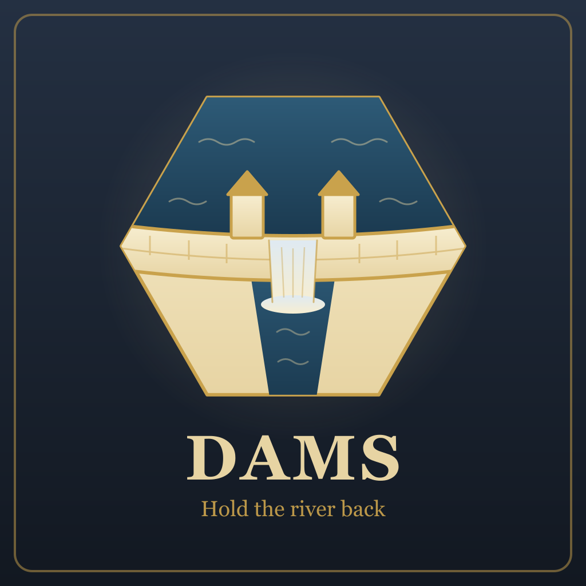
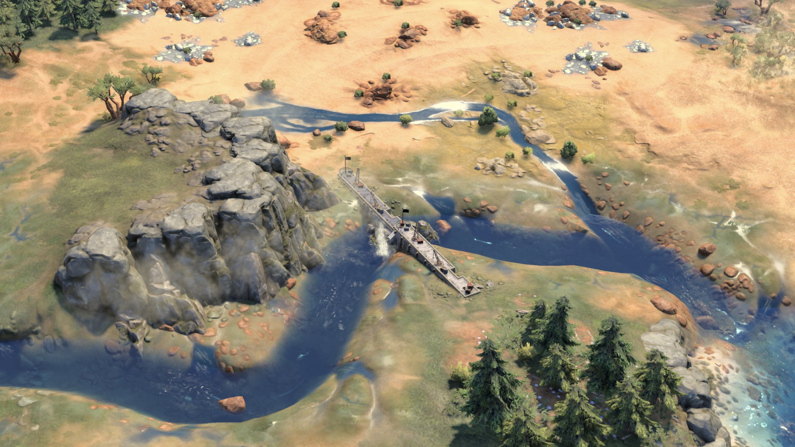
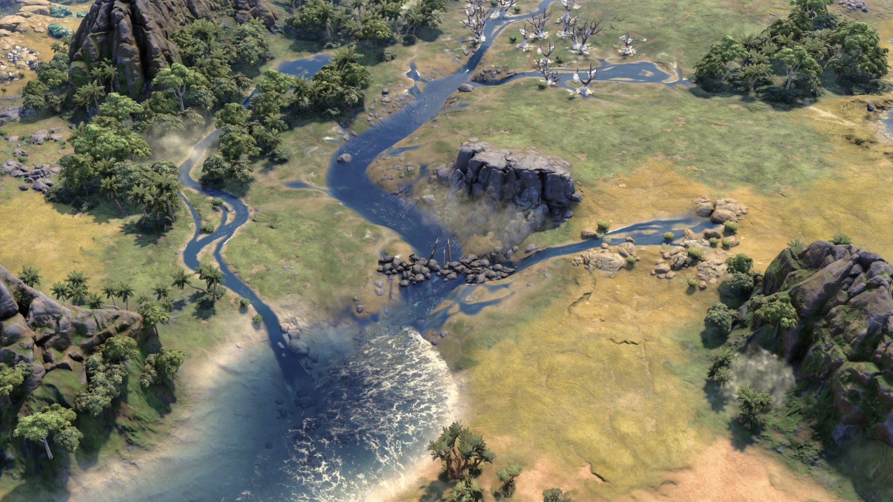
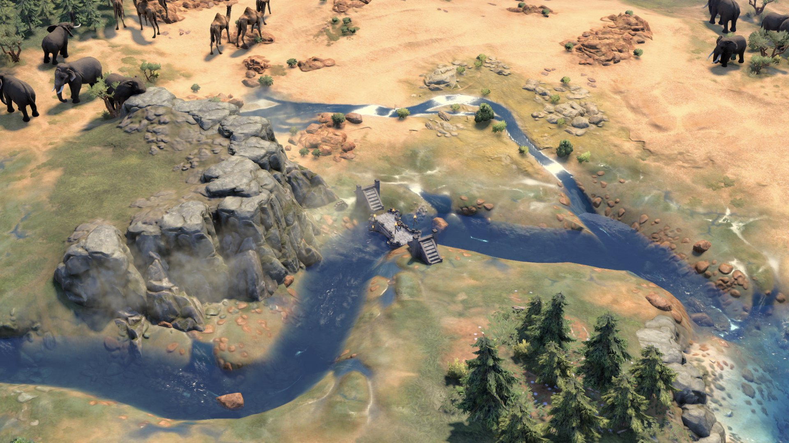

  

# Dams

A Civilization VII mod. Build a Dam on a river, navigable or not. Once it is finished, floods on that river stop
pillaging the settlements along it, and each age's Dam holds back bigger floods than the last. The cost is the valley:
the river's floodplains dry out, and the land beside it gives up their Food for good.

The Dam is an ordinary building in the production list, and a town buys it with gold like any other building. Each
age has its own Dam, unlocked by one of that age's techs. A river takes one Dam of each age.

*The Modern Dam, a concrete barrage with cranes along its crest. Each age has its own look.*

| Ancient Dam | Medieval Dam |
| --- | --- |
|  |  |
| A rough weir: two rows of boulders heaped across the channel, bank to bank. | Masonry: a stone ford with stairs down each bank and a gated arch for the flow. |

---

## What the player does

Pick the Dam in a settlement's production list and place it on a river tile, a navigable river or a land tile with a
minor river:

| Age | Building | Unlocked by | Production cost | Yields | Holds back |
| --- | --- | --- | --- | --- | --- |
| Antiquity | Ancient Dam | Irrigation | 250 | +2 Food, +1 Production | Moderate floods |
| Exploration | Medieval Dam | Machinery | 450 | +3 Food, +2 Production | Moderate and major floods |
| Modern | Modern Dam | Electricity | 750 | +3 Food, +4 Production | Every flood, 1000-year floods included |

The Dam goes where the game lets the settlement put a building, so a young settlement is offered only the river tiles
beside its city center, and more as it grows.

A river that already has a Dam from the current age, finished or under construction, is not offered again; the
placement check says "This river already has a Dam from this age." A Dam from an earlier age does not block a newer
one, so a river dammed in Antiquity can take a Medieval Dam later.

## What a Dam protects

Every settlement that owns a tile of the dammed river is protected, another player's included. The floods the Dam
holds back no longer pillage its improvements, buildings or districts; bigger floods still do damage as before.

The game has three sizes of flood: moderate, major and 1000-year. From the game's own tables, weighting each size by
how often it comes and by the share of flooded tiles it pillages (20, 40 and 60 %), the share of flood damage a Dam
prevents works out as follows:

| Dam | Floods held back | Damage prevented, by Disaster Intensity: Light (the default) / Moderate / Heavy |
| --- | --- | --- |
| Ancient | moderate | about 17 % / 29 % / 36 % |
| Medieval | moderate, major | about 50 % / 57 % / 73 % |
| Modern | moderate, major, 1000-year | all of it |

The settlement holding the Dam is covered by the Dam itself. Every other settlement on the river gets a **Levee** in
its city center, which carries the same protection as the best Dam on its river; the Levee takes no building slot,
needs no citizen, and never appears in a production list. A settlement founded on the river later, or one whose
borders reach it later, gets its Levee at the start of the next turn. When a newer Dam is finished, the Levees along
the river are raised to match; when it is razed, they fall back to the next best Dam a turn later.

## What a Dam costs

When the Dam finishes, the river's floodplains come off the map. Those tiles lose the floodplain's own Food, about 1
each, so a river with six floodplain tiles costs about six Food a turn, permanently.

Floods still happen on a dammed river, and they still leave silt behind: each flood permanently raises the Food or
Production of one to three of the river's tiles. The mod cannot prevent that. The engine has no way to stop a flood
or to take back what it deposits, and [docs/DESIGN.md](docs/DESIGN.md) records the runs behind that. A Dam stops the
damage, not the flood.

A dammed river loses all its floodplains whichever Dam stands on it, so an Ancient Dam costs as much valley as a
Modern one and protects less. It is worth building where major floods are rare or the river's floodplain tiles are
few.

Protection covers the whole settlement rather than one river, so a settlement that sits on the dammed river and on a
second river is protected on both.

## Compatibility

- Adds three Dam buildings, three Levees and their tech unlocks. Replaces no base-game files. The one base-game
  change: major and 1000-year floods get flood classes of their own, so a Dam can hold back one size and not another.
  Everything else that protects against floods (the Khmer Baray, the Water Puppet Theater, the Ho'okupu tradition, and
  other mods' flood immunity) is widened to match, so it still covers all three.
- A save loads with the mod on or off.
- Works in single player. In a network game the mod places no Levees, so a Dam protects only the settlement that
  holds it.
- Dams plus a mod that turns floods off: the Dam still dries the floodplains but protects against nothing.
- English only for now.

## How it works

- **Placement.** The Dams use the game's own river rule, the one the Bridge and the Gristmill use. The mod wraps the
  placement checks for production and for purchase, and the lists built from them, to add the rule of one Dam of each
  age per river.
- **Cost.** The mod takes the floodplain features off a dammed river when the Dam completes.
- **Protection.** The Khmer Baray's flood immunity, given to any settlement holding a Dam or a Levee. The game files
  all three floods under one flood class, and the immunity is chosen by class, so the mod gives major and 1000-year
  floods classes of their own and each age's Dam names the ones it holds back. At load, at the start of each of the
  player's turns and whenever a Dam is finished, the mod reads every Dam off the map and places the right Levee in each
  settlement on its river. That also catches a Dam bought with gold, an AI's Dam and new settlements.
- **Look.** Each finished Dam is drawn across its river from the game's own models, one look per age: a rough weir
  of heaped boulders, a stone ford with a gated arch, a concrete barrage with a spillway. They grow with the age.

The design notes and the runs behind each step are in [docs/DESIGN.md](docs/DESIGN.md).

## Status

Watched in game on Civilization VII 1.5.0: placement on navigable and minor rivers, a real build and its completion,
the one-per-age rule and the upgrade it allows, the protection of each age against each size of flood (a settlement
with no Levee pillaged by every flood, the Ancient Levee holding moderate floods only, the Medieval Levee moderate and
major, the Modern Levee all three), the Levees rising to a newer Dam and falling back when it is razed, the dried
floodplains, each age's look, the icons, a save reloaded with the mod on, a Dam carried across the Exploration to
Modern transition, and Compact Cities with its ring lock on. Not yet watched: a network game.

## Installation

1. Subscribe on the Steam Workshop, or download the zip from the
   [latest release](https://github.com/tmtmiller1/civilizationvii_dams/releases/latest).
2. Unzip it so the `dams` folder sits in the Civilization VII Mods directory.
3. Enable **Dams** from Additional Content in-game.

## Credits

By Tower. The build icon uses the ring of the base game's bridge icon.
